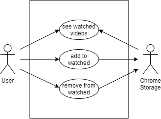

# YouTube Watched Checkbox

[](https://github.com/alex-krav/youtube-watched-checkbox/actions/workflows/build.yml)

Google Chrome extension for manual selection of YouTube watched videos.

## What for?
YouTube marks watched videos with red progress line, thus showing you videos, you've already watched.

There are Chrome Extensions available, that add 'Watched' label and darken thumbnails depending on how much of video you already watched.

However, there are cases, that are not covered with above functionality:
- you've seen this video elsewhere (another device, account, or offline)
- you are familiar with information (lecture on something you already know)
- you watched a part of video and decided that it's enough

Marked videos won't scatter your attention when searching for something or browsing channel or playlist videos.

## Main functionality
- Installing extension via Chrome Web Store
- Marking videos as 'Watched' or unmarking them back
- Data is saved in Chrome Sync Storage

## Supported pages

### Fully functional
- YouTube homepage
- Channel / User videos
- Playlist
- Video 

### When scrolling down, new videos don't receive checkbox
- YouTube search results
- Channel / User homepage and search
- /feed/subscriptions
- /feed/history

### Scrolling is not tested
- /feed/library
- /feed/explore

## Architecture

### Component diagram


### ER diagram


### Sequence diagram of key scenarios


## Roadmap

### Frontend
- fix nonworking pages
- add support for all YouTube pages
- add support for marking playlists
- allow user to see all marked videos and unmark them in batch

### Backend
- add Cloud sync (user can clear [Chrome](https://chrome.google.com/sync) data )

## Development 

### Prerequisites

* [node + npm](https://nodejs.org/) (Current Version)

### Technologies used

* TypeScript
* Webpack
* chrome.extension API  
* Mocha, Chai, Selenium

### Setup

```
npm install
```

### Build

```
npm run build
```

### Build in watch mode

```
npm run watch
```

### Load extension

Load extension on Chrome following:
1. Access `chrome://extensions/`
2. Check `Developer mode`
3. Click on `Load unpacked extension`
4. Select the `dist` folder.
5. Reload YouTube page.

### Test

```
npm run test
```
